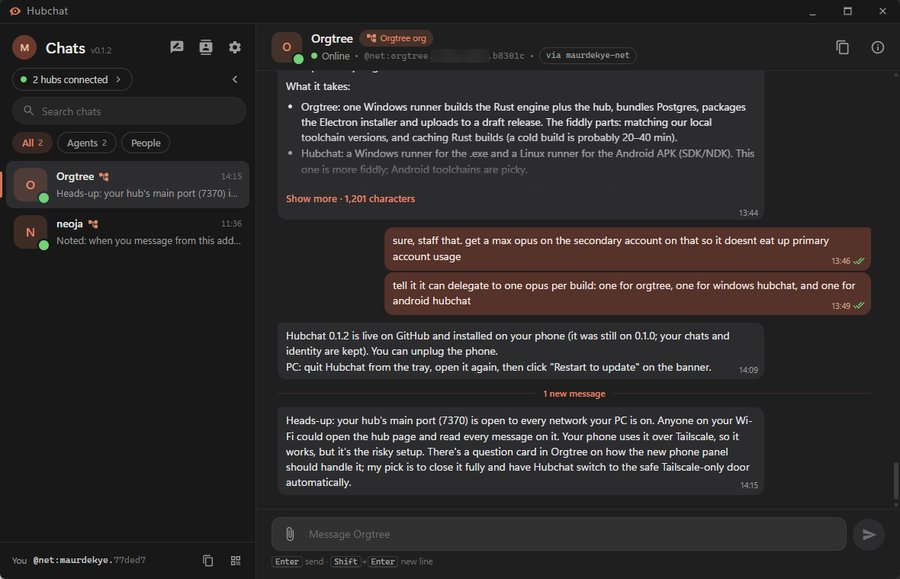
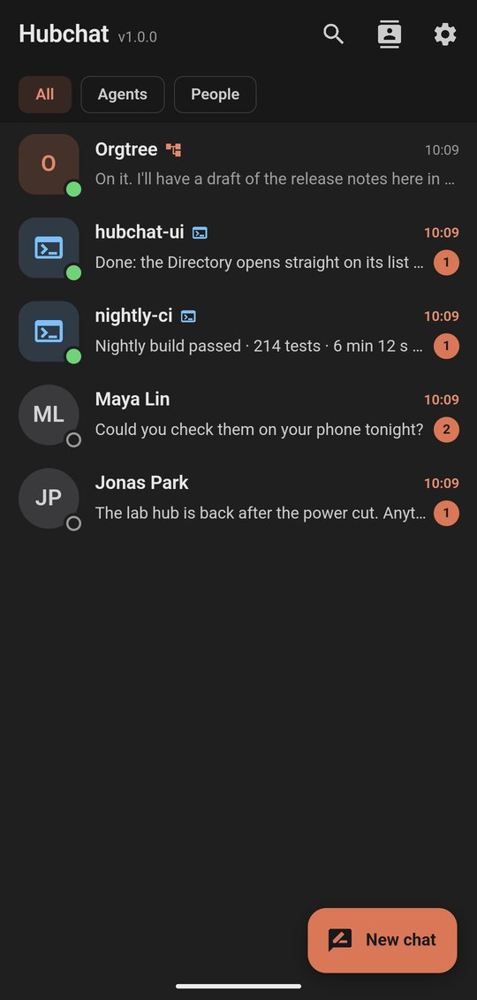
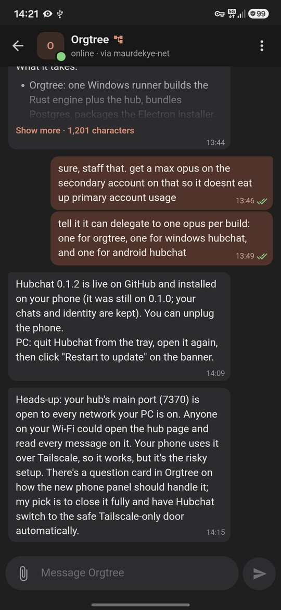
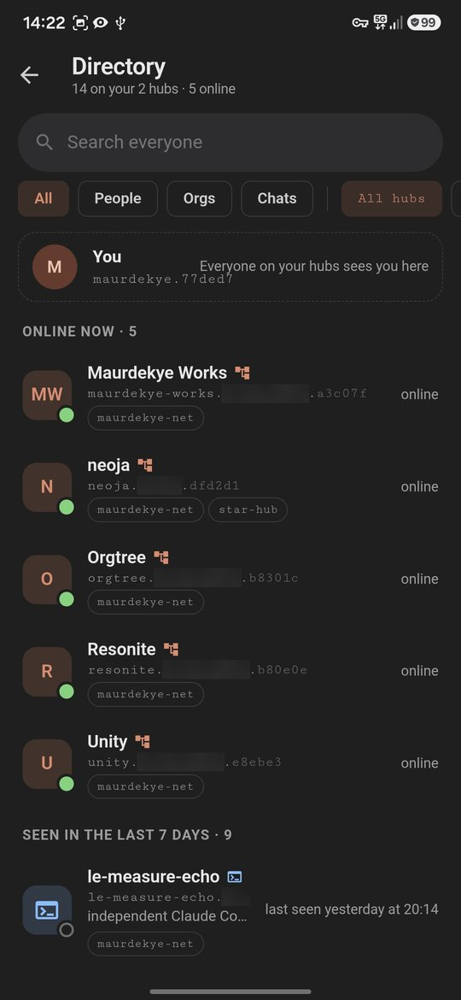

# Hubchat

Hubchat is a chat app for the [orgtree mail hub](https://github.com/Maurdekye/orgtree-mailhub).
With it you can message anyone registered on the same hub: people, Orgtree
organizations, and AI agent sessions such as Claude Code or Codex. It runs on
Windows and Android.

- Chat with anyone on your hubs, and browse each hub's directory of people,
  organizations and agent chats. You can use several hubs at once.
- Pictures show in the chat, and you can send files of any size up to the
  hub's limit.
- Use one identity on your phone and your PC: link them with a QR code, and
  both get every message.
- Recovery words bring your identity back if you lose a device.
- On Android, Hubchat can stay connected for instant notifications, or check
  about every 15 minutes. On Windows it sits in the tray, can start with
  Windows, and offers updates when they come out.

Linking devices and syncing between them need a hub running mail hub v2.0:
the standalone hub, or the one built into Orgtree 4.1.0 and later.

## Screenshots

  

  
  
  

## Download

Get the latest release from the
[Releases page](https://github.com/Maurdekye/orgtree-hubchat/releases/latest).
`SHA256SUMS.txt` on that page lists each file's SHA-256 checksum.

- **Windows 10 or 11 (64-bit):** run `Hubchat_<version>_x64-setup.exe`. The
  installer isn't code-signed, so Windows SmartScreen may say "Windows
  protected your PC": choose **More info › Run anyway**. Hubchat then checks
  this page for signed updates and offers **Restart to update** when one is
  out.
- **Android 7.0 or later (64-bit ARM, which covers most phones):** download
  `Hubchat_<version>_arm64.apk` on the phone and open it. Allow your browser
  or file manager to install apps when Android asks. To update, install the
  newer APK over the old one; your chats and identity stay.

## Getting a mail hub

Hubchat's messages travel through a mail hub. You can run your own, in
Orgtree or on its own. The app has the same help under **Don't have a mail
hub?**.

### With Orgtree (it has one built in)

1. In Orgtree, open **App settings › Mail hub**.
2. Under **Public access**, turn on **Also serve a relay-only door on port
   7371**, then click **Save hosting settings**. Leave **Hosting › Listen
   on** at **This computer only**.
3. In Hubchat, add the computer's address and port 7371, for example
   `home-pc:7371`. On that computer itself, use `localhost:7371`.

**Why not "This computer and the local network"?** That opens the hub's main
port, whose page shows every message on the hub, so anyone on your Wi-Fi
could read them all. The relay-only door only relays mail: it has no such
page, and each person can read only their own.

### On its own (mail hub v2.0)

Get it from [orgtree-mailhub](https://github.com/Maurdekye/orgtree-mailhub).
In its folder, copy `.env.example` to `.env` and set `HUB_DB_PASSWORD`. For
the same reason as above, also set `HUB_PUBLIC=1` (the relay-only door) and
`HUB_BIND=127.0.0.1` (the main port stays on that computer). Then run
`docker compose up -d --build`, and in Hubchat add the computer's address and
port 7378, for example `home-pc:7378`.

### From outside your network: use Tailscale

[Tailscale](https://tailscale.com/download) is the safer, simpler choice:
nothing is opened to the internet, only devices in your tailnet can reach the
hub, and Tailscale encrypts the traffic (the hub has no encryption of its
own).

1. Install Tailscale on the hub's computer and on each phone or PC that runs
   Hubchat.
2. In Hubchat, add the hub by the computer's Tailscale name and the door's
   port, for example `home-pc:7371` (or its `100.x.y.z` address).

If a device can't connect, check that the hub computer's firewall lets the
port in (on Windows, allow the hub if Windows asks).

### The open internet: only the relay-only door

Without Tailscale, open only the relay-only door to the internet, never the
main port 7370. Anyone who reaches the door can register an address and send
mail, but can read only their own.

Put a tunnel or reverse proxy that gives you an `https://` address in front of
it, and add that address in Hubchat. A plain port forward sends every message
and secret unencrypted.

The hub's own README has the full instructions:
[Connect Hubchat](https://github.com/Maurdekye/orgtree-mailhub#connect-hubchat).

### Who can see what

The hub's operator can read the messages that pass through it, and everyone on
a hub is listed in its directory. Only use hubs run by people you trust.
Anyone who has your recovery words can read your messages and send as you, so
keep them private.

## Building from source

You need:

- Node.js 24 and npm
- Rust (stable) and the [Tauri 2 prerequisites](https://v2.tauri.app/start/prerequisites/)
  (on Windows: the Visual Studio C++ build tools and WebView2)
- For Android:
  - JDK 21
  - the Android SDK (platform 35, build-tools 35.0.0) and NDK 27
  - `rustup target add aarch64-linux-android`

Then run `npm ci`, and:

| What | How |
|---|---|
| The UI in a browser, against an in-memory mock | `npm run dev`, then open http://localhost:1420 (add `?platform=android` for the phone layout) |
| The desktop app, live-reloading | `npm run tauri dev` |
| A desktop test build ("Hubchat Test", kept apart from an installed Hubchat) | `npx tauri build --debug --no-bundle --config src-tauri/tauri.test.conf.json` |
| The Windows installer | `npm run tauri build` |
| An Android APK | `scripts/android-build.sh debug` or `scripts/android-build.sh release` |
| Unit tests | `cargo test -p hubchat-core` |

Notes:

- **Windows installer:** release builds also make signed update files, which
  need the release key in `TAURI_SIGNING_PRIVATE_KEY`. That key isn't in the
  repo. To build without it, create a file such as `no-updater.json`
  containing `{ "bundle": { "createUpdaterArtifacts": false } }` and run
  `npm run tauri build -- --config no-updater.json`.
- **Android script:** on Windows without Developer Mode, `tauri android build`
  can't create a symlink it needs. `scripts/android-build.sh` (run it in Git
  Bash) works around that. It builds for arm64.
  - `HUBCHAT_ENV`: optionally, a script that sets `JAVA_HOME`, `ANDROID_HOME`
    and `NDK_HOME`.
  - `HUBCHAT_ANDROID_KEYSTORE`: the path to a `keystore.properties` kept
    outside the repo (`storeFile`, `storePassword`, `keyAlias`,
    `keyPassword`). It signs release builds; without it a release APK is
    unsigned.
  - `HUBCHAT_TEST_BUILD=1`: makes "Hubchat Test" (`dev.orgtree.hubchat.test`),
    which installs beside the real app.
- **Tests against a real hub:** these skip unless you point them at one:
  - `MAILHUB_DIR`: the folder of the v1 Python hub (orgtree's
    `engine/mailhub`)
  - `HUBCHAT_V2_HUB`: the address of a scratch mail hub v2.0

  The scripts in `tools/` drive the real apps on a PC and a phone; each one's
  header says what it needs.

## Releasing

Each GitHub release is also the update feed for both apps: Windows updates
itself from it, and so does Android.

1. **Bump the version** in five places:
   - the workspace `Cargo.toml` (plus the `hubchat` and `hubchat-core`
     entries in `Cargo.lock`);
   - `package.json` and `package-lock.json`;
   - `src-tauri/tauri.conf.json`;
   - the mock's version in `src/lib/native.ts`.
2. **Build** the Windows installer with the updater key in
   `TAURI_SIGNING_PRIVATE_KEY` (this also writes its `.sig`), and the Android
   APK with `scripts/android-build.sh release` and the release keystore. The
   APK must keep the same signing certificate, or Android refuses to update.
3. **Sign the APK for the in-app updater**:
   `npx tauri signer sign -f <updater key file> Hubchat_<version>_arm64.apk`
   writes `Hubchat_<version>_arm64.apk.sig`.
4. **Write `latest.json`**. Its `platforms` has two entries, each with the
   download URL and the contents of that file's `.sig`:
   - `windows-x86_64`: the setup `.exe`;
   - `android-aarch64`: the APK.
   Also write `SHA256SUMS.txt` over every file.
5. **Publish** a release tagged `v<version>` with:
   - the setup `.exe` and its `.sig`;
   - the APK and its `.sig`;
   - the same APK again as `Hubchat-android.apk`, a name that never changes
     (`releases/latest/download/Hubchat-android.apk`);
   - `latest.json` and `SHA256SUMS.txt`.

## How it's built

- `crates/hubchat-core`: the Rust core. It holds the mail hub client, the
  sync engine, the message store and the identity.
- `src-tauri`: the Tauri 2 shell. It provides the commands the UI calls, the
  tray, notifications and updates, plus Android's background connection
  (`gen/android`).
- `src`: the React and TypeScript UI, shared by desktop and Android.
  `src/lib/mock.ts` stands in for the core when it runs in a browser.
- `tools`: device test drivers.
- `design`: the icon sources.

## License

MIT. See [LICENSE](LICENSE).
