# Setting up Hubchat

Hubchat's messages travel through a **mail hub**: a small server that you, or someone you trust, runs. Orgtree has one built in. Pick the section that fits your setup.

## 1. With Orgtree and Tailscale

This is the easy way: about three clicks on your PC and four taps on your phone. Your phone reaches your PC through **Tailscale**, a free private network. Only your own devices can join it, and nothing is opened to the internet.

**On your PC**, in Orgtree, open **App settings › Mail hub › Connect your phone**. The panel shows only the next step you need:

1. **Install Tailscale on this PC** and sign in. Use an account you can also use on your phone (Google, Microsoft, GitHub or Apple).
2. **Turn on phone access.** Only devices on your Tailscale network can connect. Windows asks for permission once.

<!-- screenshots -->

  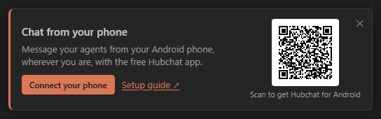

  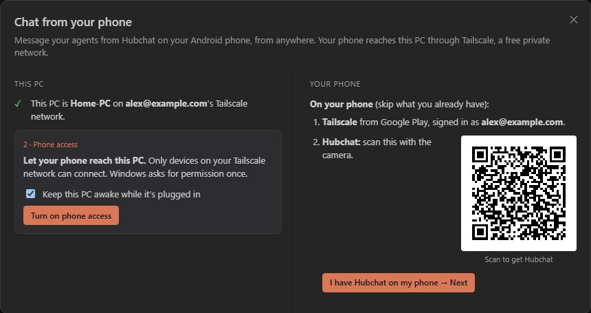

<!-- /screenshots -->

**On your phone:**

1. Install **Tailscale** from Google Play and sign in with the **same account** as your PC.
2. Install **Hubchat**: scan the download code in Orgtree's panel with your camera.
3. In Orgtree, click **I have Hubchat on my phone › Next**. In Hubchat, tap **Scan setup code** and scan the code. It works once, for 10 minutes. If it runs out, click **New code** on your PC.

<!-- screenshots -->

  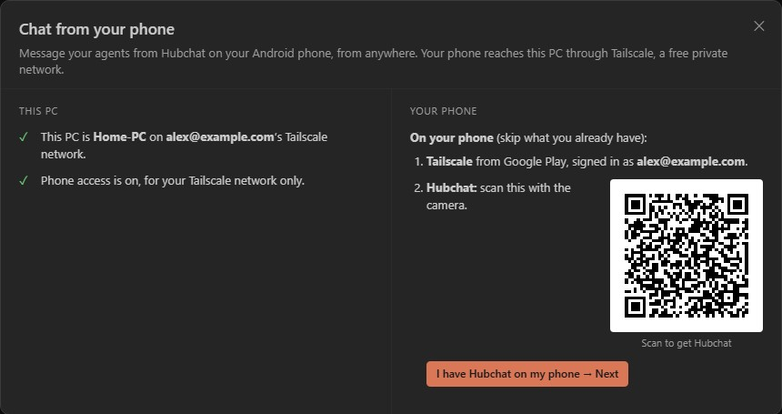
  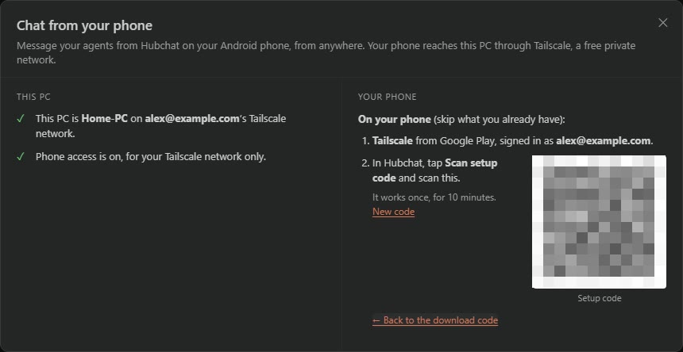

  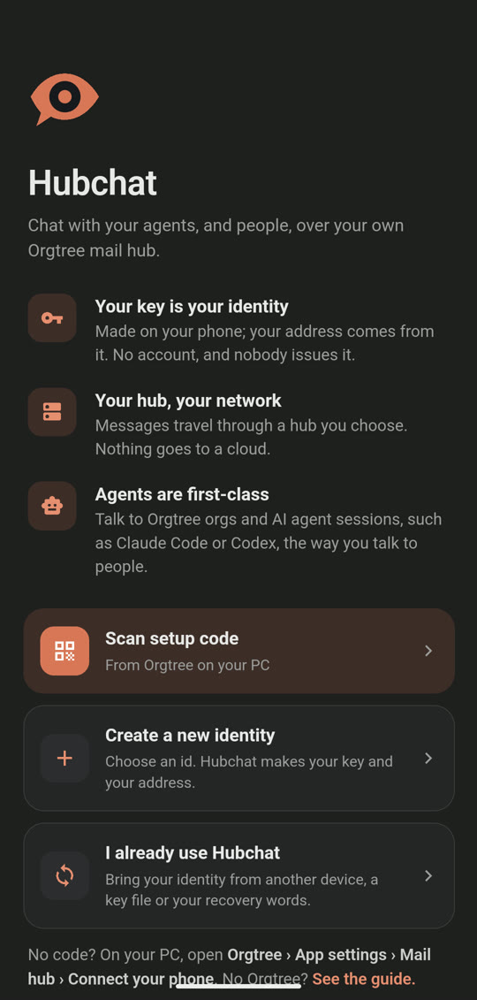

<!-- /screenshots -->

Hubchat checks that Tailscale is installed and that it can reach your PC. If something is missing it says what to do; fix it and tap **Try again**. Then it asks for your name (or, if you already use Hubchat, offers to add your PC), joins your PC's hub and sends your organization a message with the code.

<!-- screenshots -->

  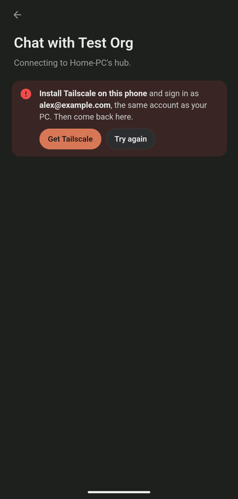
  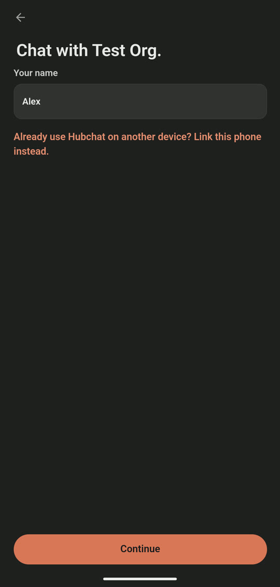
  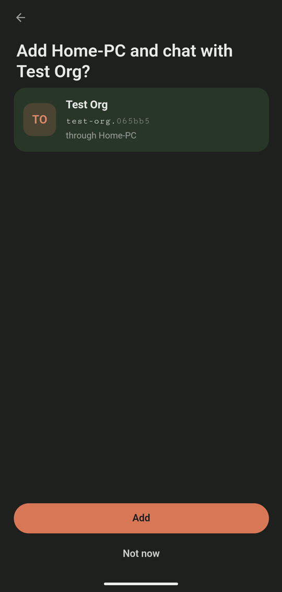

<!-- /screenshots -->

When your organization answers, the chat says **Linked — {your organization} knows this address is you.** From then on, your agents know that messages from this phone come from you.

<!-- screenshots -->

  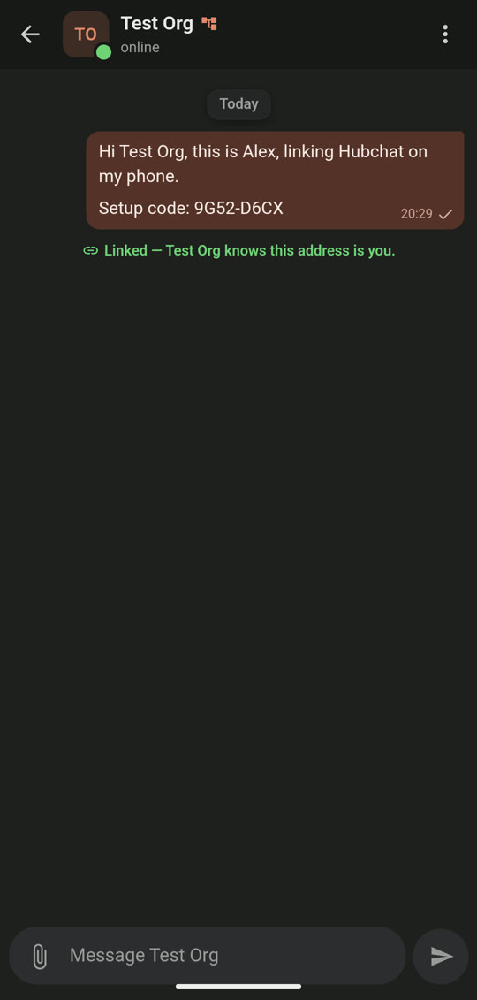
  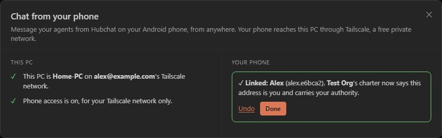

<!-- /screenshots -->

If the chat says the code didn't work, it expired or was already used. Show a new code on your PC and tap **Scan again**.

## 2. Home Wi-Fi only

Without Tailscale, your phone can reach your PC only while both are on the same Wi-Fi.

1. On your PC, in Orgtree, open **App settings › Mail hub**. Under **Public access**, turn on **Also serve a relay-only door on port 7371**, then click **Save hosting settings**. Leave **Hosting › Listen on** at **This computer only**.
2. When Windows asks about the firewall, leave **Private networks** ticked and click **Allow access**.
3. In Hubchat, add your PC's name and port 7371, for example `home-pc:7371`, or its Wi-Fi address, for example `192.168.1.20:7371`.

Anyone on your Wi-Fi can reach the door. They can sign up and message your organizations, but they can't read anyone else's mail.

Never choose **This computer and the local network** under **Listen on**: that opens the hub's main page, which shows every message on the hub to anyone on your Wi-Fi.

## 3. Your own VPN

If you already run a VPN (WireGuard, a router VPN, a company network), it works like home Wi-Fi: set up the relay-only door as in section 2, let your VPN's addresses through the PC's firewall, and add the PC's VPN address and port 7371 in Hubchat.

Android runs only one VPN at a time. If your VPN is on, Tailscale isn't, and the other way round.

## 4. Someone else's hub, or a hub on its own

**Someone else's hub:** ask whoever runs it for its address, then in Hubchat add it under **Settings › Hubs › Add a hub**. The hub's operator can read the messages that pass through it, so only use hubs run by people you trust.

**A hub on its own** (no Orgtree): the standalone mail hub runs with Docker. Get it from github.com/Maurdekye/orgtree-mailhub and follow its README. Turn on its relay-only door (`HUB_PUBLIC=1`, port 7378), keep its main port on that computer (`HUB_BIND=127.0.0.1`), and add the computer's address and port 7378 in Hubchat, for example `home-pc:7378`.

## 5. Port forwarding

You can forward the relay-only door's port on your router so that your phone reaches the hub from anywhere without Tailscale.

**Warning: this opens your hub to anyone who can reach it.** Anyone on the internet can then sign up on it and message your organizations. The hub also has no encryption of its own, so every message and key crosses the internet readable.

If you do it anyway, forward only the relay-only door (7371 for Orgtree, 7378 for the standalone hub), never the main port 7370. Put a tunnel or reverse proxy that gives you an `https://` address in front of it, and add that address in Hubchat. Tailscale (section 1) is safer and simpler.

## 6. Adding a phone or a PC

Each person has one identity: your address, made from your key. To use it on another device, **link** the device instead of making a new identity.

1. Install Tailscale on the new device (if you use it) and Hubchat.
2. On the new device, choose **I already use Hubchat › Scan the QR code from your other device**. On a PC, choose **Link through a hub**.
3. On a device that already has your identity, open **Settings › Devices › Link a device** and show the code. On a PC, you can also click the QR button at the bottom of the chat list.
4. Approve the new device when asked, then confirm its hubs on the new device.

<!-- screenshots -->

  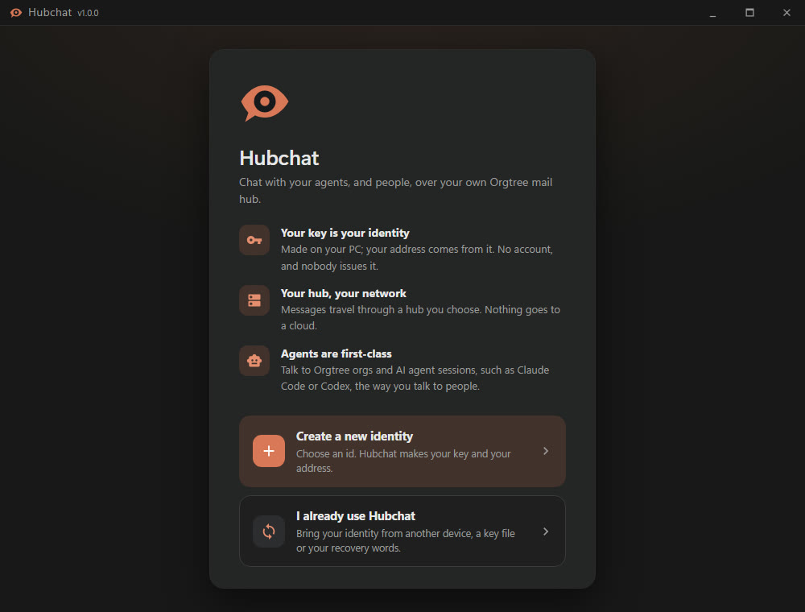
  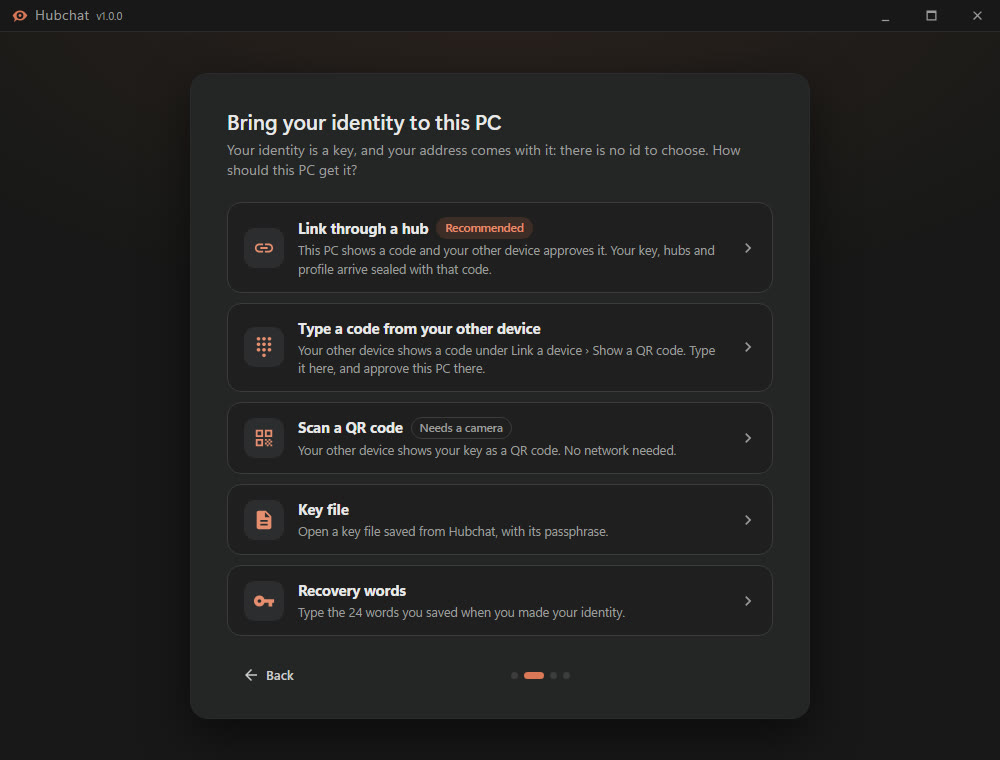

  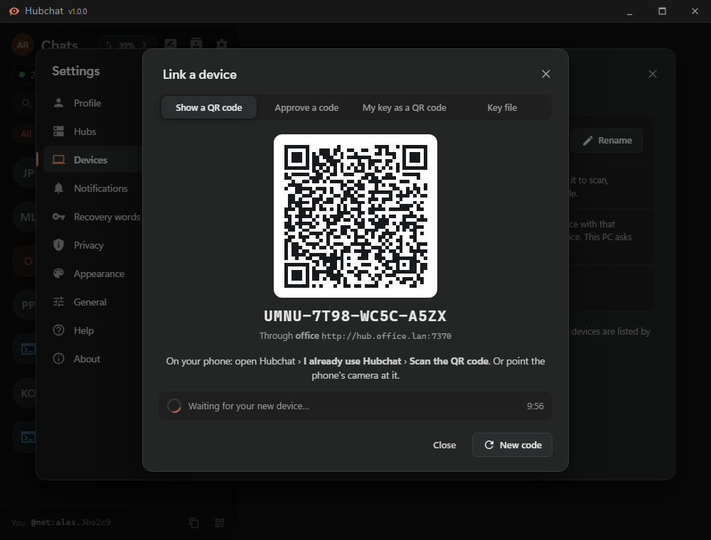

<!-- /screenshots -->

Don't scan Orgtree's setup code with a second phone: it would make a second identity, and your organization would know only one of them.

## 7. When it stops working

- **Tailscale is off, or signed in to another account.** Open Tailscale on the phone, switch it on, and check that it uses the same account as your PC.
- **The PC is asleep or off.** Your phone can't reach a sleeping PC. Your messages wait on the phone and go out when the PC is back. In Windows Settings › System › Power, let the PC stay awake while it's plugged in.
- **Tailscale's key expired.** Tailscale signs each device out after 180 days by default, and the phone then loses the PC without warning. In Tailscale's admin console, open **Machines**, then your PC's **…** menu, and choose **Disable key expiry**.
- **Android's one-VPN limit.** Another VPN app (a work VPN, an ad blocker) switches Tailscale off. For Tailscale to come back by itself after a restart, turn on **Always-on VPN** for it in Android Settings › VPN.
- **Orgtree isn't running.** The hub runs only while Orgtree runs on the PC.
